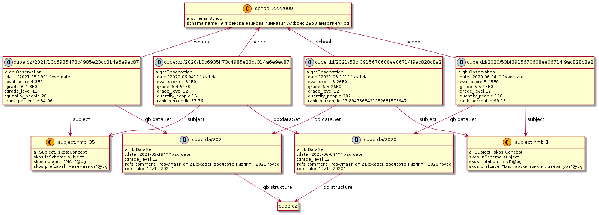

This folder contains the semantic model and diagrams

# High Level Model

The data is centered around schools and observations about them.
The schools are situated in a hierarchical administrative context.
Observations can be related to the schools themselves (such as results from exams) as well as to elements from the administrative context (the population of the city te school is in)
The following diagram illustrates this relationship. 

# Geography and administrative hierarchy

The following diagram illustrates the relationships between a school and its administrative context.
Also is shown the geographical information we collect about the various entities 
as well as some secondary relationships such as (`:capital_of` indicating that a City (`schema:City`) is the capital of a larger administrative unit (`:Municipality` ot `:Region`)

# Observations

Observations about the various entities are represented using the [RDF Data Cube Vocabulary](https://www.w3.org/TR/vocab-data-cube/)
The diagram shows four results from two different *DZI* (2020 and 2021) exams in a single school. 

Detailed information about the different `qb:DataSets` as well as the procedures for building them can be found in the [data](../data) folder.

This [SPARQL query](http://edu.ontotext.com/sparql?savedQueryName=List%20all%20available%20datasets&owner=admin&execute) lists all available `qb:DataSets`

## Visual Graph

This visual graph shows a subgraph containing observations from four distinct datasets.

[visual graph link](http://edu.ontotext.com/graphs-visualizations?saved=3263bef896644c45901b9e3d6597e83c)

# Data integration example  

[source](https://lucid.app/lucidchart/228dd727-c4c5-4439-bc67-26446829446b/edit)